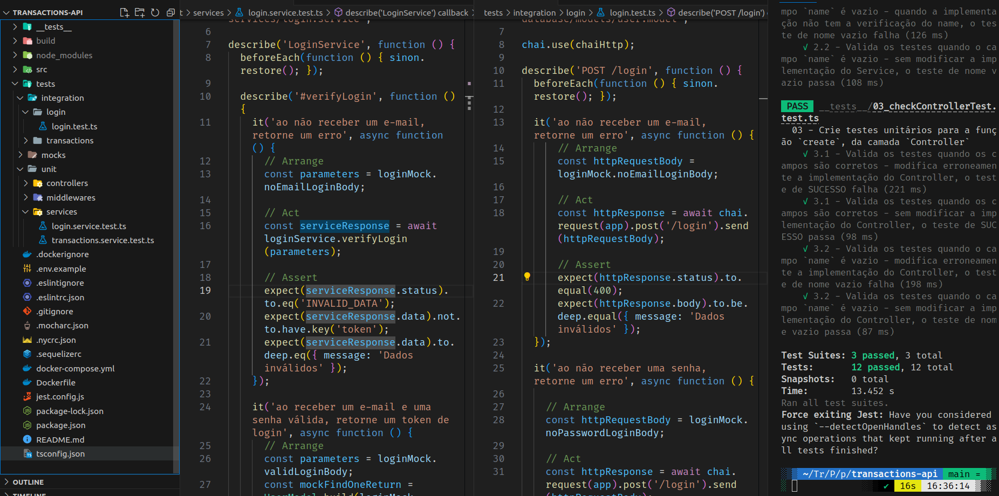

# README: Transactions API



## Project Description

The objective of this project is to develop unit and integration tests for an API that manages financial transactions of different types. The test setup includes the use of Mocha, Chai, and Sinon tools to test the behaviors of some features of the API, taking into consideration whether the routes being tested are protected by authentication or not.

### Technologies

- LINUX
- VSCODE
- NODE.JS
- MYSQL
- JAVASCRIPT
- SEQUELIZE
- MOCHA
- CHAI
- SINON

### What I Learned

- How to create automated tests to ensure that a specific functionality meets the expected behaviors
- How to apply the same test scenario in an integration test, a unit test at the service, and a unit test at the controller 

## How to Run the Project

1. Clone the repository:

   ```bash
   git clone https://github.com/feduarte-dev/transactions-api
   ```

2. Navigate to the project directory:

   ```bash
   cd your-repository
   ```

3. Initiate the containers

   ```bash
   docker-compose up -d
   docker exec -it ex_transactions_api bash
   ```
   
4. Install dependencies inside container:

   ```bash
   npm install
   ```

5. If you want to run application or tests:

   ```bash
   npm run dev
   npm run test:local
   npm run test:coverage
   ```

## Contributions

[Felipe](https://www.linkedin.com/in/feduarte-dev/) - /tests


[Trybe](https://www.betrybe.com/) - Everything else
